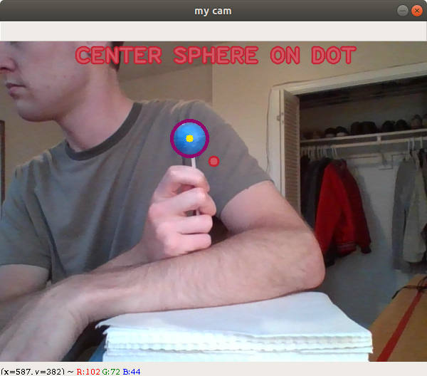
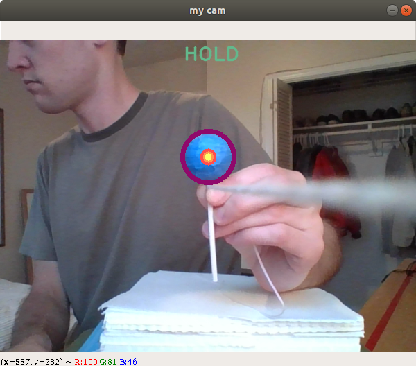
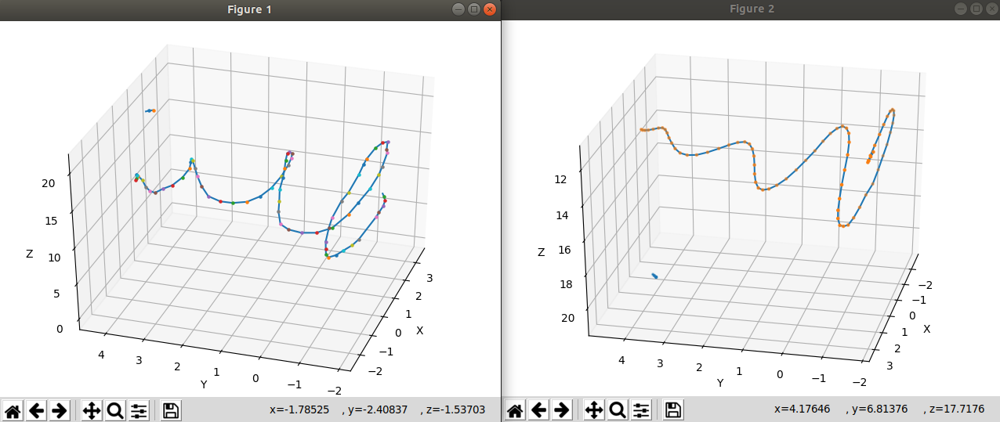
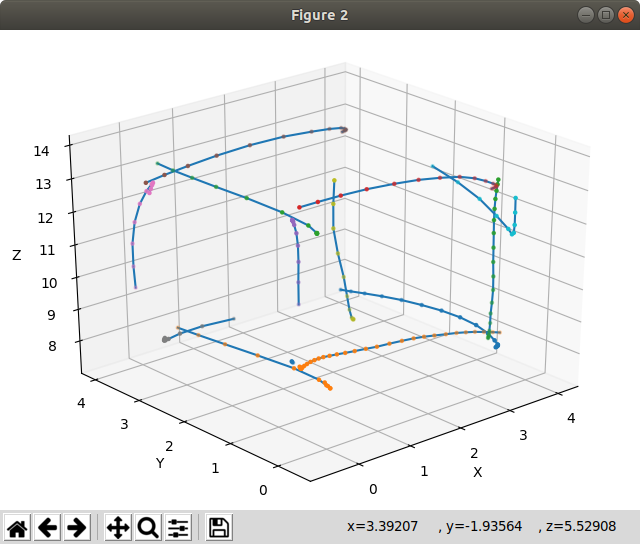

<h1 align="center">Cam Brush</h1>
<h3 align="center">The Webcam 3D Painting Tool</h3>

Cam Brush allows the user to paint in 3D space, much like Tilt Brush, by using their webcam and a spherical object such 
as a lollipop. In order to run this program the user must calibrate it to their webcam and object according to the 
instructions listed below. Further instructions along with methods and results are documented in the 
[report](docs/report.pdf).

After calibration the program tracks the spherical object in 3D space allowing the user to "paint" 3D objects by
holding down the space bar while moving the object.

## Assumptions

Cam Brush can only work if the camera remains at a fixed location pointing in a fixed direction at all times. 
It should work in varying light conditions but there should be enough light for the camera to distinguish between colors.

## Calibration

#### HSV Threshold
Out of the box the program is calibrated to track a sphere with a specific shade of blue. Thus, the user must
adjust the threshold boundaries for whichever object they decide to use. In order to calibrate Cam Brush to your 
spherical object see [section 2.1](docs/report.pdf) for selecting appropriate HSV thresholds. Your values should be
stored in the `lowerBound` and `upprBound` variables found in `main.py`

#### Geometric Properties
The user will also have to enter the geometric properties of their object before running Cam Brush. See section 2.2 of
the [report](docs/report.pdf) for more details. The sphere radius should be recorded in `TRUE_RADIUS` and
the calibration distance in `CALIBRATION_DISTANCE` in `main.py` 

## Running Program
When running command `python main.py` the program should display a webcam stream and walk the user through calibration.

After calibrated, the user can hold the space bar to begin drawing. Note, the webcam stream window must be in focus when 
holding the space bar.

To exit at any time press the escape key.

Upon exit the program should generate two windows, one with the raw input and one with the Kalman filter smooth data.

## Results

